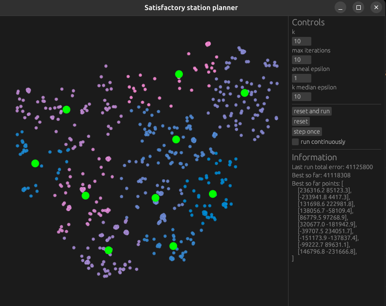

# What is this for

Since I'm planning to tap as many resource nodes as possible and ship them by
train, it is wise to find a set of train station coordinates that minimizes the
sum of distances to the aforementioned resource nodes. This is equivalent to a
k-median clustering problem and the solution is based on [Understanding the
K-median Problem](http://worldcomp-proceedings.com/proc/p2015/CSC2663.pdf) by
Whelan et.al. which unfortunately only provides a locally optimal solution, but
that's fine for now.

